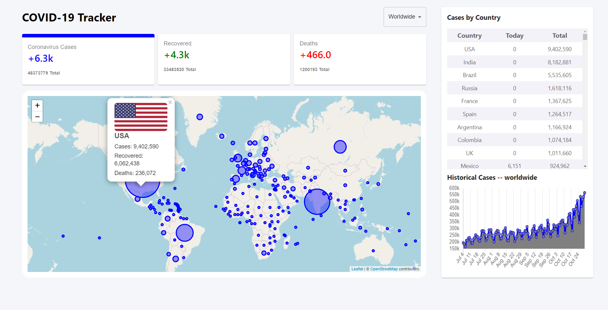

# COVID-19 Tracker

A Visual Analytical System to track daily cases of Covid-19. The system uses API provided by [disease.sh - Open Disease Data.](https://disease.sh/docs/)

## Sample Screen 

## Live Demo

Tracker as a Firebase App is available at  [https://covid19-tracker-e8026.firebaseapp.com/](https://covid19-tracker-e8026.firebaseapp.com/)

## Technologies Used
* HTML
* CSS
* JavaScript
* ReactJS
* D3.js
* Chart.js
* React Hooks
* Firebase